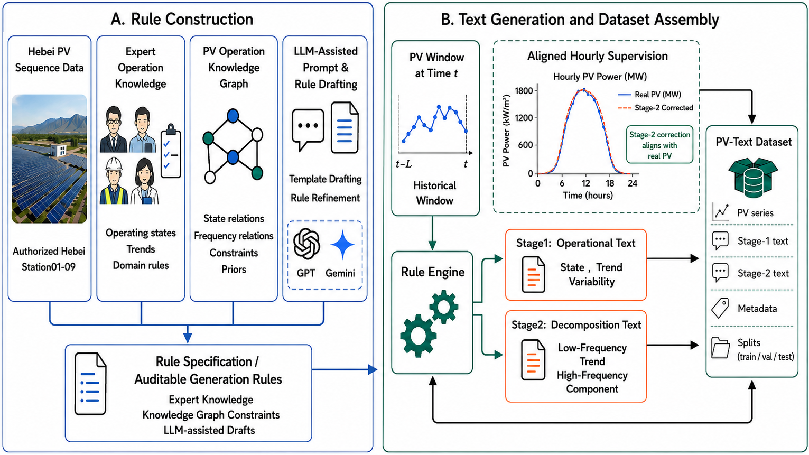

# PV-Text

**A text-augmented photovoltaic time-series dataset and open benchmark for multimodal renewable-energy forecasting.**

PV-Text extends a previously released public Hebei photovoltaic time-series dataset with two aligned hourly operational text fields, auditable text-generation rules, split metadata, benchmark runners, and audit utilities. The repository is designed for dataset and benchmark research: it provides the artifact and protocol needed to study whether structured textual context can improve photovoltaic forecasting.

This release contains **only the authorized Hebei subset**: `hebei_station00` through `hebei_station09`.

## At a Glance

| Item | Description |
|---|---|
| Dataset type | Photovoltaic time series + aligned hourly text |
| Region scope | Authorized Hebei stations only |
| Stations | `hebei_station00` to `hebei_station09` |
| Text stages | Stage-1 operational text; Stage-2 decomposition text |
| Forecast horizons | `16`, `32`, `48`, `96` |
| Benchmark tasks | Pure time-series, text-fusion, text-control |
| Metrics | MAE, MSE, RMSE |
| Release contents | Data, prompt templates, generation rules, splits, benchmark scripts, audit scripts, dataset card |
| Excluded contents | Non-Hebei stations, training logs, checkpoints, prediction arrays, result folders |

## Why PV-Text?

Most photovoltaic forecasting benchmarks evaluate models using numerical time series only. In real operation, however, forecasters often reason with textual descriptions of operating state, recent trend, variability, and frequency-level behavior. PV-Text turns this idea into a reproducible benchmark by pairing photovoltaic time-series windows with structured hourly text generated from auditable rules.

The key design choice is that the LLM is **not** used as an uncontrolled direct label generator. Instead, LLM-assisted drafting is used to help build prompt templates and normalize rule wording. The final text fields are produced by a rule engine grounded in numerical windows, expert photovoltaic operation knowledge, and photovoltaic operation knowledge-graph constraints.

## Authorized Data Scope

Only the following stations are included in this release:

```text
hebei_station00  hebei_station01  hebei_station02  hebei_station03  hebei_station04
hebei_station05  hebei_station06  hebei_station07  hebei_station08  hebei_station09
```

Do not add, redistribute, or publish non-Hebei stations unless separate data authorization is obtained.

## Repository Structure

```text
PV-Text-OpenBenchmark-github/
  data/
    hebei_daytime_0800_1900/
      hebei_station00/
      ...
      hebei_station09/
    pv_text_hebei_station00_09_daytime_0800_1900.zip

  rules/
    export_pvtext_hourly_prompts.py
    pvtext_prompt_template_recovered.md

  splits/
    hebei_chronological_splits.csv

  benchmark/
    README_text_fusion.md
    scripts/
      check_authorized_scope.py
      create_splits.py
      run_pure_ts_tsl.py
      run_text_fusion_benchmark.py
      launch_aligned_text_fusion.sh
      monitor_text_fusion.sh

  audits/
    run_dataset_benchmark_audits.py
    run_naive_and_config_audit.py

  docs/
    DATASET_CARD.md
    RELEASE_CHECKLIST.md

  requirements.txt
  LICENSE_NOTICE.md
  PACKAGE_MANIFEST.json
```

## Dataset Files

Each station directory contains five files:

| File | Role |
|---|---|
| `solar.csv` | Numerical photovoltaic and weather/NWP time-series records. |
| `solar_with_capacity.csv` | Numerical records with station capacity information. |
| `context_full_day.csv` | Intermediate context table used by the text-generation pipeline. |
| `rt_text1.jsonl` | Stage-1 hourly operational text. |
| `rt_text2.jsonl` | Stage-2 hourly decomposition text. |

The expanded dataset is available under:

```text
data/hebei_daytime_0800_1900/
```

A compact Hebei-only archive is also included:

```text
data/pv_text_hebei_station00_09_daytime_0800_1900.zip
```

## Text Design

PV-Text provides two text fields for each aligned hourly timestamp.

| Text file | Text stage | Main content |
|---|---|---|
| `rt_text1.jsonl` | Stage-1 operational text | operating state, recent trend, statistical variability |
| `rt_text2.jsonl` | Stage-2 decomposition text | low-frequency trend, high-frequency component |

The two stages are parallel descriptions generated from the same historical context. Stage-2 text is not generated from Stage-1 text.

## Construction Pipeline



## Benchmark Protocol

PV-Text defines a forecasting protocol over chronological splits:

```text
Input:  x_{t-L:t} + optional text z_t
Output: y_{t+1:t+H}
H:      16, 32, 48, 96
```

Recommended metrics:

```text
MAE, MSE, RMSE
```

Recommended reporting:

| Level | What to report |
|---|---|
| Station level | Per-station metrics for each horizon |
| Horizon level | Mean metrics over the 10 Hebei stations |
| Overall level | Mean metrics over stations and horizons |

## Benchmark Tasks

| Task | Input | Purpose |
|---|---|---|
| Pure time-series forecasting | `x_{t-L:t}` | Establish numerical forecasting baselines. |
| Text-fusion forecasting | `x_{t-L:t} + z_t` | Test whether aligned operational text improves forecasting. |
| Text-control experiments | aligned text vs shuffled text | Check whether text gains depend on temporal alignment. |

Text-fusion settings:

| Setting | Text input |
|---|---|
| `text_stage1` | Stage-1 text only |
| `text_stage2` | Stage-2 text only |
| `text_stage12` | Stage-1 and Stage-2 text combined |

## Quick Start

Install dependencies:

```bash
pip install -r requirements.txt
```

Check the authorized station scope:

```bash
python benchmark/scripts/check_authorized_scope.py \
  --data_root data/hebei_daytime_0800_1900
```

Regenerate chronological split metadata:

```bash
python benchmark/scripts/create_splits.py \
  --data_root data/hebei_daytime_0800_1900 \
  --output splits/hebei_chronological_splits.csv
```

## Pure Time-Series Baselines

Pure time-series baselines should be run through one shared Time-Series-Library environment. This keeps the data loader, scaler, split, target channel, and metric extraction comparable across models.

Example:

```bash
python benchmark/scripts/run_pure_ts_tsl.py \
  --tsl_root /root/Time-Series-Library \
  --data_root /path/to/PV-Text-OpenBenchmark-github/data/hebei_daytime_0800_1900 \
  --output_dir /root/KDD/experiments_pvtext_pure_ts \
  --models iTransformer,PatchTST,TimeXer,TimesNet,DLinear,TimeMixer,Informer \
  --pred_lens 16,32,48,96 \
  --gpus 0,1,2,3
```

Avoid mixing results from customized model repositories with Time-Series-Library results unless preprocessing, normalization, splits, and metric extraction have been audited to be identical.

## Text-Fusion Baselines

The text-fusion runner is located at:

```text
benchmark/scripts/run_text_fusion_benchmark.py
```

Additional notes are provided in:

```text
benchmark/README_text_fusion.md
```

Main settings:

| Field | Values |
|---|---|
| Models | `TimeCMA`, `CALFAdapter`, `TimeLLMAdapter`, `TextFiLM` |
| Text phases | `text_stage1`, `text_stage2`, `text_stage12` |
| Stations | `hebei_station00` to `hebei_station09` |
| Horizons | `16`, `32`, `48`, `96` |

## Rules and Templates

The rule and prompt assets are stored under `rules/`:

```text
rules/export_pvtext_hourly_prompts.py
rules/pvtext_prompt_template_recovered.md
```

These files document the template contract used to construct Stage-1 and Stage-2 text. They are included so that users can inspect, audit, and regenerate text fields under the same rule design.

## Audit and Release Checks

Audit utilities are provided under `audits/`. Before publishing a new dataset version or leaderboard table, run checks for:

- authorized station scope
- timestamp leakage
- text-numeric consistency
- text coverage
- benchmark configuration consistency

Release checklist:

```text
docs/RELEASE_CHECKLIST.md
```

Dataset card:

```text
docs/DATASET_CARD.md
```

## Not Included

The repository intentionally excludes:

```text
training logs
model checkpoints
experiment result folders
pred.npy / true.npy / metrics.npy
non-Hebei station data
```

## Citation

Citation information will be added after the dataset paper is finalized. Please also cite the original public Hebei photovoltaic time-series dataset according to its official release record.

## License

The final dataset and code license should be confirmed by the dataset owner before public release. See:

```text
LICENSE_NOTICE.md
```
